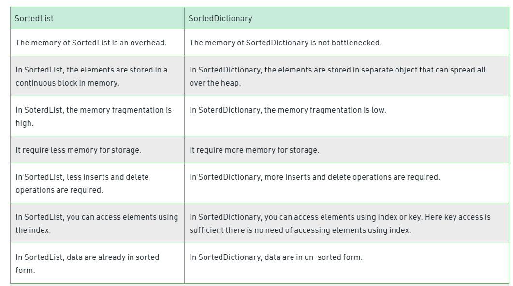
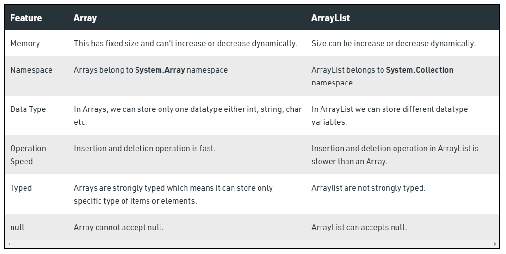

# Interview Questions

### What is C#?

C# is an object-oriented, modern programming language that was created by Microsoft. It runs on the .NET Framework. C# is very close to C/C++ and Java programming languages. The language is proposed to be a simple, modern, general-purpose, object-oriented programming language.  The language is used for creating software components.
***
### How is C# different from the C programming language?

|S.No | C Programming Language | C# Programming Language|
| :-  | :- | :-
|1.| C language supports procedural programming.|Whereas C# supports object-oriented programming.
|2.|C language supports pointers.|Whereas in C#, pointers are used only in unsafe mode.
|3.|In C language, garbage collection is not.|While in C#, garbage collection is managed by Common Language Runtime (CLR).
|4.|C language can be executed cross-platform.|Whereas .NET Framework is required to execute C# language.
|5.|By using C language we can achieve a low level of abstraction.|Whereas by using the C# we can achieve a high degree of abstraction.
|6.|C language is more on functions.|While C# is more on design.
|7.|C language gives a top-notch performance.|While C# gives an objectives standard performance.
|8.|There are 32 total keywords used in the C language.|While a total of 86 keywords are used in C#.
|9.|C language is mainly used in commercial industries and engineering.|Whereas C# is used for software formation and other networking-related objectives.

***

### What is Common Language Runtime (CLR)?

CLR is the basic and Virtual Machine component of the .NET Framework. It is the run-time environment in the .NET Framework that runs the codes and helps in making the development process easier by providing various services such as remoting, thread management, type-safety, memory management, robustness, etc.

Basically, it is responsible for managing the execution of .NET programs regardless of any .NET programming language. It also helps in the management of code, as code that targets the runtime is known as the Managed Code, and code that doesn’t target to runtime is known as Unmanaged code. To read more, refer to the article: Common Language Runtime.

*** 

### What is inheritance? Does C# support multiple inheritance?
Inheritance is an important pillar of OOP(Object Oriented Programming). It is the mechanism in C# by which one class is allowed to inherit the features(fields and methods) of another class.

- Super Class: The class whose features are inherited is known as superclass(or a base class or a parent class).
- Sub Class: The class that inherits the other class is known as a subclass(or a derived class, extended class, or child class). The subclass can add its own fields and methods in addition to the superclass fields and methods.
- Reusability: Inheritance supports the concept of “reusability”, i.e. when we want to create a new class and there is already a class that includes some of the code that we want, we can derive our new class from the existing class. By doing this, we are reusing the fields and methods of the existing class.
- C# does not support multiple class inheritance.
  
***

### What is the difference between a struct and a class in C? 

- A class is a user-defined blueprint or prototype from which objects are created. Basically, a class combines the fields and methods(member function which defines actions) into a single unit.

- A structure is a collection of variables of different data types under a single unit. It is almost similar to a class because both are user-defined data types and both hold a bunch of different data types.
***
### What is enum in C#?
Enumeration (or enum) is a value data type in C#. It is mainly used to assign the names or string values to integral constants, which make a program easy to read and maintain. For example, the 4 suits in a deck of playing cards may be 4 enumerators named Club, Diamond, Heart, and Spade, belonging to an enumerated type named Suit. Other examples include natural enumerated types (like the planets, days of the week, colors, directions, etc.). The main objective of enum is to define our own data types(Enumerated Data Types). Enumeration is declared using the enum keyword directly inside a namespace, class, or structure. To read more, refer to the article: Enum in C#
***
### What is the difference between ref and out keywords?
The ref is a keyword in C# which is used for passing the arguments by a reference. Or we can say that if any changes made in this argument in the method will reflect in that variable when the control return to the calling method. The ref parameter does not pass the property.

The out is a keyword in C# which is used for passing the arguments to methods as a reference type. It is generally used when a method returns multiple values. The out parameter does not pass the property. To read more, refer to the article: ref and out keywords
***
### What are Properties in C#?
Properties are the special type of class members that provides a flexible mechanism to read, write, or compute the value of a private field. Properties can be used as if they are public data members, but they are actually special methods called accessors. This enables data to be accessed easily and helps to promote the flexibility and safety of methods. Encapsulation and hiding of information can also be achieved using properties. It uses pre-defined methods which are “get” and “set” methods which help to access and modify the properties.

***Accessors*** : The block of “set” and “get” is known as “Accessors”. It is very essential to restrict the accessibility of the property. There are two types of accessors i.e. get accessors and set accessors. There are different types of properties based on the “get” and set accessors:

- Read and Write Properties: When property contains both get and set methods.
- Read-Only Properties: When property contains only the get method.
- Write Only Properties: When property contains only set method.
- Auto Implemented Properties: When there is no additional logic in the property accessors, and it introduces in C# 3.0. To read more, refer to the article: Properties in C#
***
### What is the difference between constant and read-only in C#?
In C#, a const keyword is used to declare constant fields and constant local. The value of the constant field is the same throughout the program or in other words, once the constant field is assigned the value of this field is not be changed. In C#, constant fields and locals are not variables, a constant is a number, string, null reference, boolean values. readonly keyword is used to declare a readonly variable. This readonly keyword shows that you can assign the variable only when you declare a variable or in a constructor of the same class in which it is declared.

***
### Can multiple catch blocks be executed?
The main purpose of the catch block is to handle the exception raised in the try block. This block is only going to execute when the exception is raised in the program. In C#, You can use more than one catch block with the try block. Generally, multiple catch block is used to handle different types of exceptions means each catch block is used to handle different type of exception. If you use multiple catch blocks for the same type of exception, then it will give you a compile-time error because C# does not allow you to use multiple catch block for the same type of exception. A catch block is always preceded by the try block.

In general, the catch block is checked within the order in which they have occurred in the program. If the given type of exception is matched with the first catch block, then the first catch block executes and the remaining of the catch blocks are ignored. And if the starting catch block is not suitable for the exception type, then the compiler searches for the next catch block. 
***
### What is Jagged Arrays?
A jagged array is an array of arrays such that member arrays can be of different sizes. In other words, the length of each array index can differ. The elements of Jagged Array are reference types and initialized to null by default. Jagged Array can also be mixed with multidimensional arrays. Here, the number of rows will be fixed at the declaration time, but you can vary the number of columns. To read more, refer to the article: Jagged Array in C#
***
### What’s the difference between the System.Array.CopyTo() and System.Array.Clone() ?
The System.Array.CopyTo() technique makes a replica of the components into another existing array. It makes copies the components of one cluster to another existing array. The Clone() technique returns a new array object containing every one of the components in the first array. The Clone() makes a duplicate of an array as an object, consequently should be cast to the real exhibit type before it tends to be utilized to do definitely. The clone is of a similar type as the first Array.

### What is the difference between “is” and “as” operators in C#?

C# includes three keywords that support runtime type identification: is, as, and typeof. 

is operator: We can determine if an object is of a particular type by using the is operator. Its general form is shown here:
```
expr is type
```
Here, expr is an expression that describes an object whose type is being tested against type. If the type of expr is that the same as, or compatible with, type, then the result of this operation is true. Otherwise, it is false. Thus, if the result is true, expr is a  form of type. Because it applies to is, one type is compatible with another if both are the equivalent of type, or if a reference, boxing, or unboxing conversion exists.

As ***operator*** : Sometimes if we want to try a conversion at runtime, but not throw an exception if the conversion fails (which is the case when a cast is used). To do this, use the as operator, which has this general form:
```
expr as type
```
Here, expr is the expression being converted to type. If the conversion succeeds, then a reference to type is returned. Else, a null reference is returned. The as the operator can be used to perform only reference, boxing, unboxing, or identity conversions. The as operator offers a streamlined alternative to is in some cases.
***

### What is tuple in C#?
The word Tuple means “a data structure which consists of the multiple parts”. So tuple is a data structure that gives you the easiest way to represent a data set that has multiple values that may/may not be related to each other. It was introduced in .NET Framework 4.0. In tuple, you can add elements from 1 to 8. If you try to add elements greater than eight, then the compiler will throw an error. Tuples are generally used when you want to create a data structure that contains objects with their properties and you don’t want to create a separate type for that.
***
### What are namespaces in C#?
It provides a way to keep one set of names(like class names) different from other sets of names. The biggest advantage of using namespace is that the class names which are declared in one namespace will not clash with the same class names declared in another namespace. It is also referred as named group of classes having common features. To read more about this, please refer to Namespaces in C#
***
### Who can be the members of namespaces in C#?
The members of a namespace can be namespaces, interfaces, structures, and delegates.

***
### What are indexers in C# .NET?
Indexers are known as smart arrays in C#. It allows the instances of a class to be indexed in the same way as an array. To read more, refer to the article: C# indexers
***

### What is the JIT compiler process?
Just-In-Time compiler(JIT) is a part of Common Language Runtime (CLR) in .NET which is responsible for managing the execution of .NET programs regardless of any .NET programming language. A language-specific compiler converts the source code to the intermediate language. This intermediate language is then converted into the machine code by the Just-In-Time (JIT) compiler. This machine code is specific to the computer environment that the JIT compiler runs on. To read more, refer to the article: What is Just-In-Time(JIT) Compiler in .NET?
***
### What is the  System. String and System.Text.StringBuilder classes?
C# StringBuilder is similar to Java StringBuilder. A String object is immutable, i.e. a String cannot be changed once created. Every time when you use any of the methods of the System. String class, then you create a new string object in memory. For example, a string “GeeksForGeeks” occupies memory in the heap, now, changing the initial string “GeeksForGeeks” to “GFG” will create a new string object on the memory heap instead of modifying the initial string at the same memory location. In situations where you need to perform repeated modifications to a string, we need the StringBuilder class.

To avoid string replacing, appending, removing, or inserting new strings in the initial string C# introduce StringBuilder concept. StringBuilder is a dynamic object. It doesn’t create a new object in the memory but dynamically expands the needed memory to accommodate the modified or new string. To read more, refer to the article: System.String and System.Text.StringBuilder in C#
***
### What is garbage collection in C#?
Automatic memory management is made possible by Garbage Collection in .NET Framework. When a class object is created at runtime, certain memory space is allocated to it in the heap memory. However, after all the actions related to the object are completed in the program, the memory space allocated to it is a waste as it cannot be used. In this case, garbage collection is very useful as it automatically releases the memory space after it is no longer required. 

Garbage collection will always work on Managed Heap, and internally it has an Engine which is known as the Optimization Engine. Garbage Collection occurs if at least one of multiple conditions is satisfied. These conditions are given as follows:

If the system has low physical memory, then garbage collection is necessary.
If the memory allocated to various objects in the heap memory exceeds a pre-set threshold, then garbage collection occurs.
If the GC.Collect method is called, then garbage collection occurs. However, this method is only called under unusual situations as normally garbage collector runs automatically.
To read more, refer to the article: Garbage collection in C#.

### What are the types of classes in C#?
- Abstract class
- Partial class
- Sealed class
- Static class
***
### What is the difference between C# abstract class and an interface?
|Abstract Class |Interface  |
| :-            | :-        |
|It contains both declaration and definition parts.|It contains only a declaration part.
|Multiple inheritance is not achieved by an abstract class.|Multiple inheritance is achieved by the interface.
|It contains a constructor.|It does not contain a constructor.
|It can contain static members.|It does not contain static members.
|It can contain different types of access modifiers like public, private, protected, etc.|It only contains public access modifier because everything in the interface is public.
|The performance of an abstract class is fast.|The performance of the interface is slow because it requires time to search the actual method in the corresponding class.
|It is used to implement the core identity of class.|It is used to implement the peripheral abilities of the class.
|A class can only use one abstract class.|A class can use multiple interfaces.
|If many implementations are of the same kind and use common behavior, then it is superior to use an abstract class.|If many implementations only share methods, then it is superior to use Interface.
|An abstract class can contain methods, fields, constants, etc.|The interface can only contain methods.
|It can be fully, partially, interface or not implemented.|It should be fully implemented.
***
### What are extension methods in C#?
In C#, the extension method concept allows you to add new methods in the existing class or in the structure without modifying the source code of the original type, and you do not require any kind of special permission from the original type and there is no need to re-compile the original type. It is introduced in C# 3.0. To read more, refer to the article: Extension methods in C#
***
### What are partial classes in C#?
A partial class is a special feature of C#. It provides a special ability to implement the functionality of a single class into multiple files and all these files are combined into a single class file when the application is compiled. A partial class is created by using a partial keyword. This keyword is also useful to split the functionality of methods, interfaces, or structure into multiple files.
```
public partial Class_name  {
    // Code 
}
```
***
### What is the difference between late binding and early binding in C#?
When an object is assigned to an object variable of the specific type, then the C# compiler performs the binding with the help of .NET Framework. C# performs two different types of bindings which are:

- Early Binding 
- Late Binding or Dynamic Binding
  
It recognizes and checks the methods, or properties during compile time. In this binding, the compiler already knows about what kind of object it is and what are the methods or properties it holds, here the objects are static objects. The performance of early binding is fast and it is easy to code. It decreases the number of run-time errors.

In late binding, the compiler does not know about what kind of object it is and what are the methods or properties it holds, here the objects are dynamic objects. The type of the object is decided on the basis of the data it holds on the right-hand side during run-time. Basically, late binding is achieved by using virtual methods. The performance of late binding is slower than early binding because it requires lookups at run-time. To read more, refer to the article: Early binding and Late Binding
***
### What are the different ways in which a method can be Overloaded in C#?
Method Overloading is the common way of implementing polymorphism. It is the ability to redefine a function in more than one form. A user can implement function overloading by defining two or more functions in a class sharing the same name. C# can distinguish the methods with different method signatures. i.e. the methods can have the same name but with different parameters list (i.e. the number of the parameters, order of the parameters, and data types of the parameters) within the same class.

- Overloaded methods are differentiated based on the number and type of the parameters passed as arguments to the methods.
- You can not define more than one method with the same name, Order, and type of the arguments. It would be a compiler error.
- The compiler does not consider the return type while differentiating the overloaded method. But you cannot declare two methods with the same signature and different return types. It will throw a compile-time error. If both methods have the same parameter types, but different return types, then it is not possible. 
***
### What is Reflection in C#?
Reflection is the process of describing the metadata of types, methods, and fields in a code. The namespace System. Reflection enables you to obtain data about the loaded assemblies, the elements within them like classes, methods, and value types. To read more, refer to the article: Reflection in C#
***
### What is Managed or Unmanaged Code? 
A code that is written to aimed to get the services of the managed runtime environment execution like CLR(Common Language Runtime) in .NET Framework is known as Managed Code. It is always implemented by the managed runtime environment instead of directly executed by the operating system. The managed runtime environment provides different types of services like garbage collection, type checking, exception handling, bounds checking, etc. to code automatically without the interference of the programmer. It also provides memory allocation, type safety, etc to the code. The application is written in the languages like Java, C#, VB.Net, etc. is always aimed at runtime environment services to manage the execution, and the code written in these types of languages is known as managed code.

A code that is directly executed by the operating system is known as Unmanaged code. It is always aimed at the processor architecture and depends upon computer architecture. When this code is compiled it always tends to get a specific architecture and always runs on that platform, in other words, whenever you want to execute the same code for the different architecture you have to recompile that code again according to that architecture. It always compiles to the native code that is specific to the architecture. To read more, refer to the article: Managed and Unmanaged code 
***
### What is Multithreading with .NET?
Multi-threading is a process that contains multiple threads within a single process. Here each thread performs different activities. For example, we have a class and this call contains two different methods, now using multithreading each method is executed by a separate thread. So the major advantage of multithreading is it works simultaneously, which means multiple tasks execute at the same time. And also maximizing the utilization of the CPU because multithreading works on time-sharing concept mean each thread takes its own time for execution and does not affect the execution of another thread, this time interval is given by the operating system. 
***
### What is LINQ in C#?
LINQ is known as Language Integrated Query and it is introduced in .NET 3.5 and Visual Studio 2008. The beauty of LINQ is it provides the ability to .NET languages(like C#, VB.NET, etc.) to generate queries to retrieve data from the data source. For example, a program may get information from the student records or accessing employee records, etc. In, past years, such type of data is stored in a separate database from the application, and you need to learn different types of query language to access such type of data like SQL, XML, etc. And also you cannot create a query using C# language or any other .NET language.

To overcome such types of problems Microsoft developed LINQ. It attaches one, more power to the C# or .NET languages to generate a query for any LINQ compatible data source. And the best part is the syntax used to create a query is the same no matter which type of data source is used means the syntax of creating query data in a relational database is the same as that used to create query data stored in an array there is no need to use SQL or any other non-.NET language mechanism. You can also use LINQ with SQL, with XML files, with ADO.NET, with web services, and with any other database. To read more, refer to the article: LINQ in C#
***
### What are delegates in C#?
A delegate is an object which refers to a method, or you can say it is a reference type variable that can hold a reference to the methods. Delegates in C# are similar to the function pointer in C/C++. It provides a way that tells which method is to be called when an event is triggered. For example, if you click a button on a form (Windows Form application), the program would call a specific method. In simple words, it is a type that represents references to methods with a particular parameter list and return type and then calls the method in a program for execution when it is needed. To read more, refer to the article: Delegates in C# 
***

### What are sealed classes in C#?
Sealed classes are used to restrict the users from inheriting the class. A class can be sealed by using the sealed keyword. The keyword tells the compiler that the class is sealed, and therefore, cannot be extended. No class can be derived from a sealed class.

The following is the syntax of a sealed class :
```
sealed class class_name
{
    // data members
    // methods
    .
    .
    .

}
```
A method can also be sealed, and in that case, the method cannot be overridden. However, a method can be sealed in the classes in which they have been inherited. If you want to declare a method as sealed, then it has to be declared as virtual in its base class. To read more, refer to the article: Sealed Classes in C#
***
### What is the Constructor Chaining in C#? 
We can call an overloaded constructor from another constructor using this keyword but the constructor must belong to the same class because this keyword is pointing to the members of the same class in which this is used. This type of calling the overloaded constructor is also termed as Constructor Chaining. To read more, refer to the article: Constructor Chaining
***
### Describe Accessibility Modifiers in C#?
Access Modifiers are keywords that define the accessibility of a member, class, or datatype in a program. These are mainly used to restrict unwanted data manipulation by external programs or classes. There are 4 access modifiers (public, protected, internal, private) which defines the 6 accessibility levels as follows:

- public
- private
- private protected
- protected
- internal
- protected internal
***
### What is a Virtual Method in C#?
In C# virtual method is a strategy that can be reclassified in derived classes. We can implement the virtual method in the base class and derived class. It is utilized when a method’s fundamental work is similar but in some cases derived class needed additional functionalities. A virtual method is declared in the parent class that can be overridden in the child class. We make a virtual method in the base class by using the virtual keyword and that method is overridden in the derived class using the Override keyword.  It is not necessary for every derived class to inherit a virtual method, but a virtual method must be created in the base class. Hence the virtual method is also known as Polymorphism. To read more, refer to the article: Virtual Method in C#
***
### What is File Handling in C#?
Generally, the file is used to store the data. The term File Handling refers to the various operations like creating the file, reading from the file, writing to the file, appending the file, etc. There are two basic operations that are mostly used in file handling is reading and writing of the file. The file becomes stream when we open the file for writing and reading. A stream is a sequence of bytes that is used for communication. Two streams can be formed from the file one is the input stream which is used to read the file and another is the output stream is used to write in the file. In C#, the System.IO namespace contains classes that handle input and output streams and provide information about file and directory structure.
***
### List down the commonly used types of exceptions?
An exception is an error that happens at runtime. Using C#’s exception-handling subsystem, we can, during a structured and controlled manner, handle runtime errors. The primary advantage of exception handling is that it automates much of the error handling code. An Exception handling is additionally important because C# defines standard exceptions for common program errors, like divide-by-zero or index-out-of-range.

C# Exception with their meaning:

- ArrayTypeMismatchException: This exception comes when the Type of value being stored is incompatible with the type of the array.
- DivideByZeroException: It comes when the user tries to division an integer value by zero.
- IndexOutOfRangeException: When an array index is out-of-bounds, it exception occurred.
- InvalidCastException: A runtime cast is invalid.
- OutOfMemoryException: Insufficient free memory exists to continue program execution.
- OverflowException: An arithmetic overflow occurred.
- NullReferenceException: An attempt was made to operate on a null reference—that is, a reference that does not refer to an object.
***
###  What is Singleton design pattern in C#?
Singleton design pattern in C# is a common design pattern. In this pattern, a class has just one instance in the program that gives global access to it. Or we can say that a singleton is a class that permits only one instance of itself to be made and usually gives simple access to that instance.

There are different approaches to carry out a singleton design in C#. Coming up next are the regular attributes of a singleton design.  

- Private and parameterizes single constructor
- Sealed class.
- Static variable to hold a reference to the single made example
- A public and static method of getting the reference to the made example.
***
### How to implement a singleton design pattern in C#?
We can implement a singleton design pattern in C# using:

- No Thread Safe Singleton.
- Thread-Safety Singleton.
- Thread-Safety Singleton using Double-Check Locking.
- Thread-safe without a lock.
- Using .NET 4’s Lazy<T> type.
***
###  What are Events?
An event is a notification that some action has occurred. Delegates and events are related because an event is built upon a delegate. Both expand the set of programming tasks to which C# can be applied. It is an important C# feature is built upon the foundation of delegates: the event. An event is, essentially, an automatic notification that some action has occurred. Events work like this:

An object that has an interest in an event registers an event handler for that event. When the event occurs, all registered handlers are called. Event handlers are represented by delegates.

 Events are members of a class and are declared using the event keyword. Its most commonly used form is shown here:
```
event event-delegate event-name;
```
 Here, event-delegate is the name of the delegate used to support the event, and event-name is the name of the specific event object being declared.

***

<br>
<br>

# Advanced C# Interview Questions

### What is the difference between to dispose and finalize methods in C#?
The primary difference between dispose() and finalize() is that the dispose() must be explicitly invoked by the user and the finalize() is called by the garbage collector when the object is destroyed.

### What is a multicasting delegate in C#?
Multicasting of delegate is an extension of the normal delegate(sometimes termed as Single Cast Delegate). It helps the user to point more than one method in a single call.

### What are Generics in C#?
Generic is a class that allows the user to define classes and methods with the placeholder. Generics were added to version 2.0 of the C# language. The basic idea behind using Generic is to allow type (Integer, String, … etc, and user-defined types) to be a parameter to methods, classes, and interfaces. A primary limitation of collections is the absence of effective type checking. This means that you can put any object in a collection because all classes in the C# programming language extend from the object base class. This compromises type safety and contradicts the basic definition of C# as a type-safe language. In addition, using collections involves a significant performance overhead in the form of implicit and explicit type casting that is required to add or retrieve objects from a collection. To read more, refer to the article: Generics in C#

### What is Boxing and Unboxing in C#?
Boxing and unboxing is an important concept in C#. C# Type System contains three data types: Value Types (int, char, etc), Reference Types (object), and Pointer Types. Basically, it converts a Value Type to a Reference Type, and vice versa. Boxing and Unboxing enable a unified view of the type system in which a value of any type can be treated as an object.

***Boxing In C#*** : 
- The process of Converting a Value Type (char, int, etc.) to a Reference Type(object) is called Boxing.
- Boxing is an implicit conversion process in which object type (supertype) is used.
- The Value type is always stored in Stack. The Referenced Type is stored in Heap.

***Unboxing In C#*** : 
- The process of converting the reference type into the value type is known as Unboxing.
- It is an explicit conversion process.
***
### What is a Hash table class in C#?
The Hashtable class represents a collection of key/value pairs that are organized based on the hash code of the key. This class comes under the System. Collections namespace. The Hashtable class provides various types of methods that are used to perform different types of operations on the hashtables. In Hashtable, keys are used to access the elements present in the collection. For very large Hashtable objects, you can increase the maximum capacity to 2 billion elements on a 64-bit system.
***

### Why a private virtual method cannot be overridden in C#?
Because private virtual methods are not accessible outside the class.
***
### Write a Features of Generics in C#?
Generics is a technique that improves your programs in many ways such as:

- It helps you in code reuse, performance, and type safety.
- You can create your own generic classes, methods, interfaces, and delegates.
- You can create generic collection classes. The .NET Framework class library contains many new generic collection classes in System.Collections.Generic namespace.
- You can get information on the types used in generic data types at run-time.
***
### Difference between SortedList and SortedDictionary in C#.
SortedList a collection of key/value pairs that are sorted according to keys. By default, this collection sort the key/value pairs in ascending order. It is of both generic and non-generic types of collection. 

SortedDictionary a generic collection that is used to store the key/value pairs in the sorted form and the sorting is done on the key. 

<p align="center">
  
</p>

***
### What is the difference between Dispose() and Finalize() methods?
The main difference between both methods is that Dispose() method is used to release the unmanaged resources of an object while Finalize is also used for the same purpose but it doesn’t guarantee the garbage collection of an object. Another major difference is that dispose() method is explicitly invoked by the user and finalize() method is invoked by the garbage collector, just before the object is destroyed.
***

### What is the difference between Array and ArrayList?
An array is a group of like-typed variables that are referred to by a common name. ArrayList represents an ordered collection of an object that can be indexed individually. It is basically an alternative to an array. Below are the major differences

Array vs ArrayList in C#
<p align="center">
  
</p>
