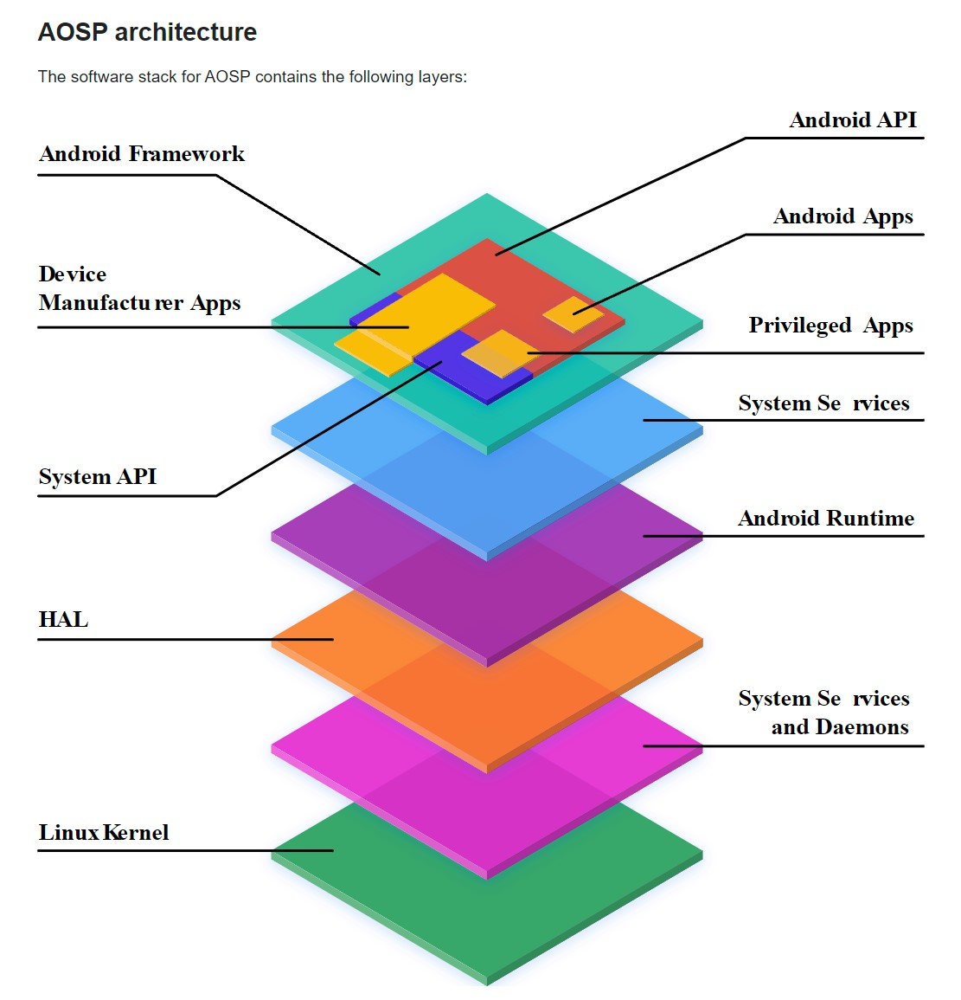

# APOS Architecture

### Overview

  

### 1. Android app
- An app created solely using the Android API. Google Play Store is widely used to find and download Android apps, though there are many other alternatives.
- In some cases, a device manufacturer might want to pre-install an Android app to support the core functionality of the device. If you're interested in developing Android apps, refer to developers.android.com

### 2. Privileged app
- An app created using a combination of the Android and system APIs. 
- These apps must be preinstalled as privileged apps on a device.

### 3. Device manufacturer app
- An app created using a combination of the Android API, system API, and direct access to the Android framework implementation.
- Because a device manufacturer might directly access unstable APIs within the Android framework, these apps must be preinstalled on the device and can be updated only when the device's system software is updated.

### 4. System API
- The System API represents Android APIs available only to partners and OEMs for inclusion in bundled applications.
- These APIs are marked as @SystemApi in the source code.

### 5. Android API
- The Android API is the publicly available API for third-party Android app developers.
- For information on the Android API, refer to Android API reference.

### 6. Android framework
- A group of Java classes, interfaces, and other precompiled code upon which apps are built.
- Portions of the framework are publicly accessible through the use of the Android API. Other portions of the framework are available only to OEMs through the use of the system APIs.
- Android framework code runs inside an app's process.

### 7. System services
- Android System service is a background process that operates invisibly to the user, providing essential functions and resources to the Android OS and applications. 
-  These services encompass a wide range of tasks, including managing hardware components like the camera or Wi-Fi, enforcing security and permissions to protect user data, handling notifications, and ensuring smooth inter-app communication.
- Functionality exposed by Android framework API communicates with system services to access the underlying hardware.

### 8. Android runtime (ART)
- A Java runtime environment provided by AOSP. 
- ART performs the translation of the app's bytecode into processor-specific instructions that are executed by the device's runtime environment.

### 9. Hardware Abstraction layer (HAL)
- A HAL is an abstraction layer with a standard interface for hardware vendors to implement.
- For Android applications, HAL provides API’s through which the service can place a request to the device.
- Android application/framework communicates with the underlying hardware through Java APIs not by system calls.But Linux has the ability to handle only system calls from applications.Thus we need a glue layer between the Android framework and the Linux system. Android HAL allows the Android application/framework to communicate with the hardware-specific device drivers.
- Using a HAL lets you implement functionality without affecting or modifying the higher level system. For further information, see the HAL overview.

### 10. Native daemons and libraries
- Native daemons in this layer include init, healthd, logd, and storaged. These daemons interact directly with the kernel or other interfaces and don't depend on a userspace-based HAL implementation.
- Native libraries in this layer include libc, liblog, libutils, libbinder, and libselinux. These Native libraries interact directly with the kernel or other interfaces and don't depend on a userspace-based HAL implementation.

### 11. Kernel
- The kernel is the central part of any operating system and talks to the underlying hardware on a device.
- Where possible, the AOSP kernel is split into hardware-agnostic modules and vendor-specific modules.
- For a description, including definitions, of AOSP kernel components, refer to the Kernel overview.