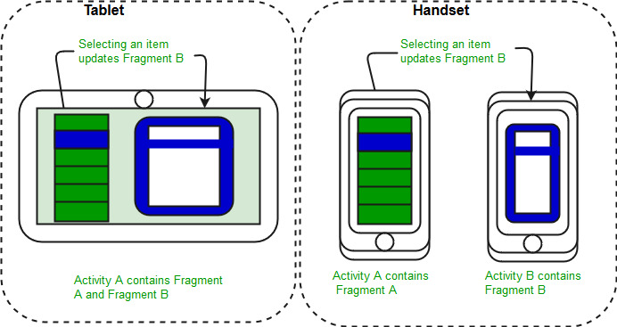

# Android Fundamentals

### Intents

In Android, intents are a messaging object used to request an action from another app component.
Intents facilitate communication between different components such as activities, services, and broadcast receivers.


#### Uses :
 1. ***Start an activity*** : Launch a new activity or existing activity.
    ```
    class SampleActivity : AppCompatActivity() {
        override fun onCreate() {}
    }

    val intent = Intent(this, SampleActivity::class.java)
    startActivity(intent)
    ```

 2. ***Start a service*** : Initiate a service to perform background operations.
    ```
    class SampleService : Service() {
        override fun onBind(): IBinder? {}
        override fun onStartCommand(): Int {}
        override fun onDestroy() {}
    }

    val serviceIntent = Intent(this, SampleService::class.java)
    startService(serviceIntent)

    ```
 3. ***Deliver a broadcast*** : Send a message to multiple apps or system components.
       ```
    class SampleBroadcastReceiver : BroadcastReceiver() {
        override fun onReceive(context: Context, intent: Intent) {}
    }

    val myBroadcastReceiver = SampleBroadcastReceiver()
    val intentFilter = IntentFilter("com.example.MY_ACTION")
    registerReceiver(myBroadcastReceiver, intentFilter)

    val broadcastIntent = Intent("com.example.MY_ACTION")
    sendBroadcast(broadcastIntent)
    ```
   
#### Types of Intents : 
1. ***Explicit Intent***:
   - Specifies the component to start by name 
   - Example 
       - Launch an activity using its name.
       - Launch YouTube using its service name.
  
2. ***Implicit Intent***:
   - Does not specify the component; instead, it declares a general action to perform, allowing the system to find a component that can handle the intent.
   - Example 
     - While selecting share image from gallery, Android shows all apps who can share images.
     - When selecting payment methods Android will redirect you to all listed payment apps.
     - while sending an email, Android will show you all the apps which can send emails.  

***

### Introduction to Fragments

- Fragment is a piece of an activity that enables a more modular activity design.
- A fragment encapsulates functionality so that it is easier to reuse within activities and layouts.
- Android devices exist in a variety of screen sizes and densities. Fragments simplify the reuse of components in different layouts and their logic.
- You can build single-pane layouts for handsets (phones) and multi-pane layouts for tablets. You can also use fragments also to support different layouts for landscape and portrait orientation on a smartphone.

<p align="center">
  
</p>

#### Types of Fragments

1. Single frame fragments : Single frame fragments are using for hand hold devices like mobiles, here we can show only one fragment as a view.
2. List fragments : fragments having special list view is called as list fragment
3. Fragments transaction : Using with fragment transaction. we can move one fragment to another fragment.

#### Fragment Lifecycle 

- ***onAttach()*** : The fragment instance is associated with an activity instance. The fragment and the activity is not fully initialized. Typically you get in this method a reference to the activity which uses the fragment for further initialization work.
- ***onCreate()*** : The system calls this method when creating the fragment. You should initialize essential components of the fragment that you want to retain when the fragment is paused or stopped, then resumed.
- ***onCreateView()*** : The system calls this callback when it’s time for the fragment to draw its user interface for the first time. To draw a UI for your fragment, you must return a View component from this method that is the root of your fragment’s layout. You can return null if the fragment does not provide a UI.
- ***onActivityCreated()*** : The onActivityCreated() is called after the onCreateView() method when the host activity is created. Activity and fragment instance have been created as well as the view hierarchy of the activity. At this point, view can be accessed with the findViewById() method. example. In this method you can instantiate objects which require a Context object
- ***onStart()*** : The onStart() method is called once the fragment gets visible.
- ***onResume()*** : Fragment becomes active.
- ***onPause()*** : The system calls this method as the first indication that the user is leaving the fragment. This is usually where you should commit any changes that should be persisted beyond the current user session.
- ***onStop()*** : Fragment going to be stopped by calling onStop()
- ***onDestroyView()*** : Fragment view will destroy after call this method
- ***onDestroy()*** :called to do final clean up of the fragment’s state but Not guaranteed to be called by the Android platform.


